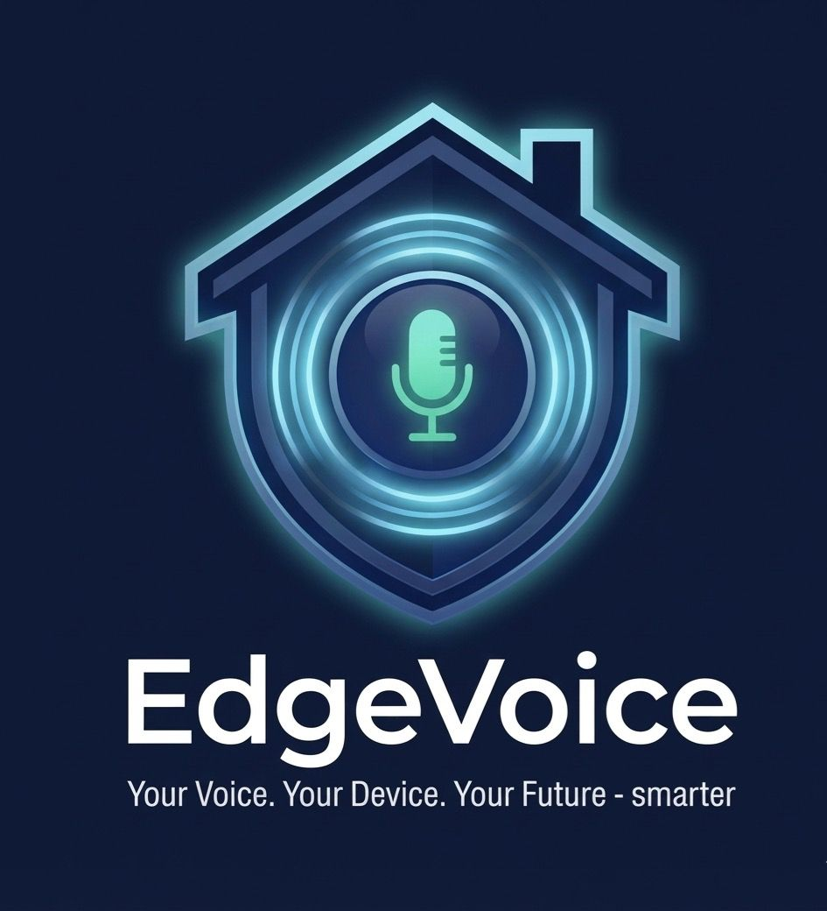

# EdgeVoice 🎙️

**EdgeVoice** is a modern, AI-powered voice assistant and Smart Home controller built using Flutter. The app features a futuristic "Cyberpunk/Dark Mode" aesthetic, utilizing custom gradients, vector assets, and a secure authentication flow to provide a premium user experience.

---

## 🚀 Key Features

### 🏠 Smart Home Control
* **Persistent Navigation:** Uses `IndexedStack` to maintain state across Home, Rooms, Logs, and Settings tabs.
* **Dynamic Room Management:** 
    * Add, edit, and delete rooms.
    * Square grid layout for better space utilization.
    * **Drag-and-Drop Reordering:** Long-press to rearrange rooms in your preferred order.
* **Device Management:** Add or remove devices (Lights, TV, AC, etc.) within specific rooms.
* **Remote Sync:** 10-second polling checks an external API for pending commands and updates local UI states automatically.

### 🎙️ Voice Assistant (AI Integrated)
* **Speech-to-Text (STT):** High-accuracy voice recognition for hands-free control.
* **Smart Command Matching:** Processes natural language to toggle specific devices (e.g., "Turn on living room lights").
* **Automated Listening:** Automatically stops listening after detecting silence for 2 seconds.

### 📊 Logs & Monitoring
* **Real-time Logs:** Tracks user actions and remote commands in a dedicated Logs tab.
* **API Integration:** Connects to a custom REST API for persistent command history and logging.

### 🔐 Authentication & Security
* **Firebase Auth:** Secure login and registration with persistent sessions (auto-login on restart).
* **Validation:** Robust form validation for email formats and password strength.
* **Cyberpunk UI:** Consistent dark theme using Cyan accents (`0xFF00F0FF`) and high-end gradients.

---

## 🛠️ Tech Stack

* **Framework:** [Flutter](https://flutter.dev/) (Dart)
* **Backend:** Firebase (Auth & Core)
* **REST API:** custom .NET API for IoT command handling.
* **State Management:** `Provider` & `StatefulWidget`
* **Local Services:** `SpeechToText`, `PermissionHandler`, `Http`

---

## 📂 Project Structure

```text
lib/
├── screens/
│   ├── welcome_screen.dart     # Landing/Splash page
│   ├── login_screen.dart       # User Sign-in
│   ├── create_account_screen.dart # User Registration
│   ├── home_screen.dart        # Master Dashboard (IndexedStack)
│   ├── rooms_screen.dart       # Grid-based Room & Device Management
│   ├── logs_screen.dart        # History of commands and actions
│   └── settings_screen.dart    # Profile & App configuration
├── services/
│   ├── auth_service.dart       # Firebase Authentication
│   └── api_service.dart        # REST API for Commands & Logs
├── widgets/
│   └── custom_widgets.dart     # Reusable UI components
└── main.dart                   # App entry point & Auth stream
```

---

## 🏁 Getting Started

1.  **Clone the repository:**
    ```bash
    git clone https://github.com/MostafaMo426/EdgeVoice.git
    ```
2.  **Install dependencies:**
    ```bash
    flutter pub get
    ```
3.  **Firebase Setup:**
    * Run `flutterfire configure` to set up your project.
    * The app uses `DefaultFirebaseOptions` for multi-platform support (Web, Android, iOS).
4.  **Run the app:**
    ```bash
    flutter run
    ```

---

## 📸 Screenshots

| Dashboard | Rooms Grid | Voice Control |
|:---:|:---:|:---:|
|  | *(Add screenshot)* | *(Add screenshot)* |

---

## 🗺️ Progress Roadmap

### ✅ Phase 1: Foundation & Security (Completed)
- [x] High-fidelity Cyberpunk UI.
- [x] Firebase Auth Integration (Sign Up/Login).
- [x] Persistent "User Session" (Auto-login).
- [x] Bottom Navigation with `IndexedStack`.

### ✅ Phase 2: Smart Home & API (Completed)
- [x] **Rooms System:** Square grid with Drag-to-Reorder logic.
- [x] **REST API Integration:** Command polling and Log submission.
- [x] **Device CRUD:** Full management of devices inside rooms.

### 🗣️ Phase 3: Voice Core (Completed)
- [x] **Speech-to-Text:** Live voice recognition.
- [x] **Logic Engine:** Pattern matching for voice commands.
- [x] **Auto-Silence Detection:** 2-second timeout for better UX.

### 🧠 Phase 4: Future Improvements
- [ ] **Text-to-Speech (TTS):** Give the assistant a voice to reply.
- [ ] **LLM Integration:** Connect to OpenAI/Gemini for smarter conversations.
- [ ] **Real-time WebSockets:** Replace 10s polling with instant updates.

---

## 👨‍💻 Contributors

* **Mostafa Mohamed** - *Lead Developer*

## 📄 License

This project is licensed under the MIT License.
